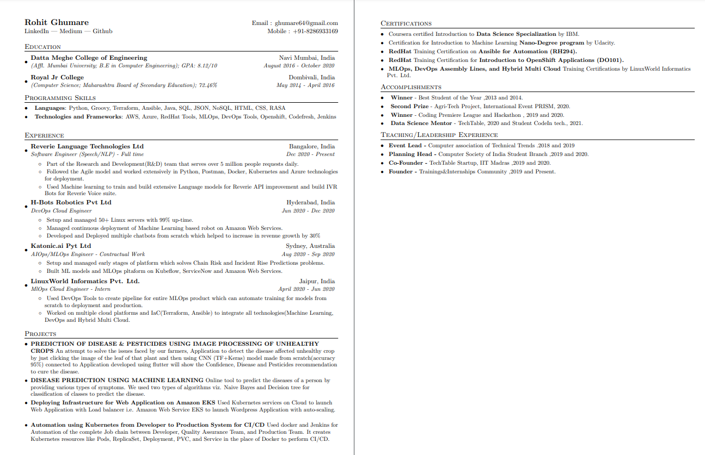

# One-Pager Resume Template

This repository contains a one-column resume template specifically designed for software developers. It leverages base LaTeX templates and fonts to ensure ease of use and installation, making it straightforward to update your resume with necessary links and references.

## Features

- **Single-Column Layout**: Focuses on readability and professional appearance.
- **Custom LaTeX Commands**: Simplifies formatting and modifications.
- **Well-Documented Sections**: Each section of the resume is clearly outlined, making it easy to customize according to your educational background, work experience, and projects.

## Sections

The template includes three main sections:
1. **Education**: Outline your academic background.
2. **Experience**: Detail your professional history.
3. **Projects**: Showcase relevant projects that highlight your skills and achievements.

## Preview

Here's a sneak peek of what the resume looks like:



### Online Editing

#### Option 1: Overleaf
1. **Create an Account**: Go to [Overleaf](https://www.overleaf.com) and sign up or log in.
2. **New Project**: Click on 'New Project' and select 'Upload Project'.
3. **Upload Files**: Zip the LaTeX files from your local repository and upload the `.zip` file to Overleaf.
4. **Edit Online**: Use Overleaf's online LaTeX editor to make changes.
5. **Download PDF**: Compile and download the PDF directly from Overleaf.

## Writing and Editing Your Resume

To write and edit your resume using this LaTeX template, follow these steps:

### Step 1: Install LaTeX
If you haven't already, install a LaTeX distribution for your operating system:
- For Windows, use [MiKTeX](https://miktex.org/)
- For macOS, use [MacTeX](http://www.tug.org/mactex/)
- For Linux, use [TeX Live](https://tug.org/texlive/)

### Step 2: Clone the Repository
Clone this repository to your local machine using:
```bash
git clone https://github.com/your-repository/one_pager_resume_template.git
```

### Step 3: Edit the LaTeX Files
Open the `.tex` files in your favorite LaTeX editor. Here are some recommended editors:
- [TeXworks](http://www.tug.org/texworks/)
- [TeXstudio](https://www.texstudio.org/)
- [Overleaf](https://www.overleaf.com) (Web-based)

### Step 4: Understanding LaTeX Syntax
Familiarize yourself with basic LaTeX commands. Here are some key concepts:
- **Document Class**: Define the type of document (`\documentclass{article}`).
- **Packages**: Include additional functionality (`\usepackage{packagename}`).
- **Sections**: Organize your document (`\section{title}`).
- **Text Formatting**: Bold (`\textbf{text}`), italicize (`\textit{text}`), underline (`\underline{text}`), etc.
- **Lists**: Create bullet points (`\begin{itemize}`) or numbered lists (`\begin{enumerate}`).

### Step 5: Customize Your Resume
Use the custom commands provided in the template to add your personal information, educational background, work experience, and projects.

### Step 6: Compile the Document
Compile the `.tex` file to produce a PDF. This can usually be done within your LaTeX editor or via the command line:
```bash
pdflatex your_resume.tex
```

## License

The template format is licensed under the MIT License. Please note that while the format is freely usable and modifiable, any personal data (such as the example data seen in the screenshot) belongs to Rohit Ghumare and should not be used without permission.

## Contributing

Contributions to improve the template are welcome. Please fork the repository and submit a pull request with your suggested changes.

## Acknowledgements

Thanks to all contributors who have helped in refining this template and to the LaTeX community for the tools and packages that make this type of work possible.
